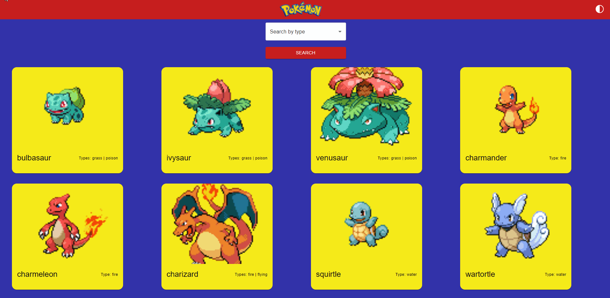

# About the Pokédex

This project is an application made with React to build a Pokédex using an API named PokéAPI (https://pokeapi.co/), as a task from DevQuest.

A Pokédex is some type of pocket computer used in the Pokémon anime/games to read informations about the creatures like abilities, moves, natural habits, types and name.

## Overview

### Pokédex: https://pokedex-liart-eight.vercel.app/



## Features

- This application list 12 pokémons per page.

- More pokémons can be loaded with the button above the footer.

- The application has a theme switcher, with which the user can chose between 'light' and 'dark'.

- Every pokémon is displayed at a single card, witch provides the name, type and sprite.

- Once you click at the card, the moveset and abilities will be shown.

- At the main page, a filter can be use to search the pokémons by type.   

## Build with

- `React` ( https://eslint.org/ )
    * A JavaScript library used to build the main logic and components.

- `Java Script` ( https://developer.mozilla.org/en-US/docs/Web/JavaScript )
    * The main programming language used in the project, which was imbued with CSS and HTML elements.  

- `React Router DOM` ( https://reactrouter.com/en/main )
    * Its a npm package that enables you to implement dynamic routing in a web app. In the Pokédex was used to display the pages, allowing the users to navigate.

- `Context API` ( https://legacy.reactjs.org/docs/context.html )
    * Was used to manage the theme switch application, allowing the components to share the state between them.

- `Mui Components` ( https://mui.com/ )
    * MUI offers a comprehensive suite of free UI tools to help deliver new features faster.. Used to build more elaborate and visually appealing components. 

- `Axios` ( https://www.npmjs.com/package/axios )
    * A JavaScript library used for making HTTP requests from a web browser or a Node. js server.

- `ESlint` ( https://eslint.org/ )
    * ESLint is a static code analysis tool that checks your JavaScript code for common problems, such as syntax errors, formatting issues, code style violations, and potential bugs. 

- `Vercel` ( https://vercel.com/ )
    * Used to buiuld and deploy  the application. 

## Run the application

To run the application on your machine, follow the next steps:

1. Clone the repositorie

   ```sh
   git clone https://github.com/Lucas-Pereia/pokedex
   ```

2. Install the dependencies

   ```sh
   npm install
   ```

3. Initialize the server

   ```sh
   npm run dev
   ```

## What I learned

While working at this project, I had the chance to exercise some skills, most of them were about **React** and how to build an usable and visual apealing aplication. 

At the begining, as a pokémon fan, my goal was to made the most beautifull pokédex ever, but while building the application I had problems with requests from **PokéAPI**, styling with **Mui Components** and formatting the elements. Even **ESlint** at some point made me loss a couple of hair.

This is still one of my first projects, so I got to know a lot of basic tools, like **Vercel**. I believe it was an excellent opportunity to go deeper into Node, with a topic that I am familiar with.

[See the deployment](https://pokedex-liart-eight.vercel.app/)

## Author

Created by Lucas Pereira de Sousa
  - [Linkedin](https://www.linkedin.com/in/lucas-pereira-sousa-dev/)

  - [Github](https://github.com/Lucas-Pereia)

